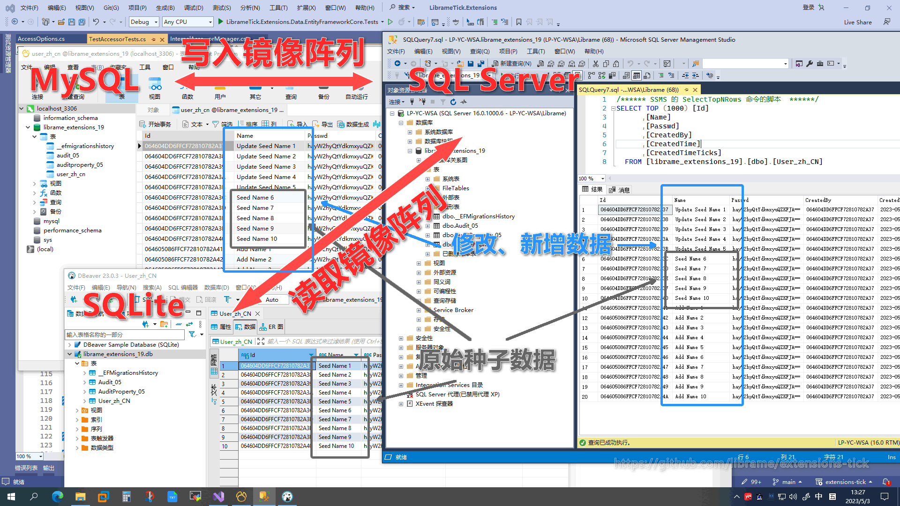

LibrameTick.Extensions 系列
=========================

简体中文

LibrameTick.Extensions 是一个基于 .NET 6 的基础框架系列库，也是针对原 [Librame.Extensions](https://github.com/librame/extensions/blob/master/README.md) 系列库重构而成的下一代基础框架系列库。本系列库主要包括 LibrameTick.Extensions 基本扩展和基于基本扩展开发的包括 LibrameTick.Extensions.Core 核心、LibrameTick.Extensions.Data.EntityFrameworkCore 数据、LibrameTick.Extensions.Drawing.SkiaSharp 图画等四个基本扩展库。

本系列库在保留上一代功能的基础上，相对于上一代做了尽可能多的精简和优化，将上一代中的 Librame.Extensions.Encryption 加密、Librame.Extensions.Network 网络、Librame.Extensions.Storage 存储等基本扩展库的功能整合进了核心基本扩展库，将数据基本扩展库的大多数接口和抽象功能整合进了基本扩展库中，使得本代框架系列库在功能上的设计更为合理；同时利用 .NET 6 的新特性，在性能上做了尽可能多的优化，使得本代框架系列库在性能上得到了较大提升。

## 开始

LibrameTick.Extensions APIs 可以使用 NuGet 包管理器添加到项目中。官方发布在 [NuGet](https://www.nuget.org/packages?q=LibrameTick.Extensions) 上。

## 特点

参见 [上一代](https://github.com/librame/extensions/blob/master/README.md) 基础框架系列库功能特性。

## 如何使用

以 Librame.Extensions.Data.EntityFrameworkCore 数据基本扩展库为例：

### 安装

    PM> Install-Package: Librame.Extensions.Data.EntityFrameworkCore

### 示例

将单个应用程序项目的 MySQL、SQLServer、SQLite 三种数据库配置为异构独立数据库冗余阵列（RAHID），其中将 MySQL、SQLServer 二种数据库配置为支持数据写入镜像同步，SQLite 数据库配置为支持数据读取，同时 MySQL、SQLServer 两种数据库支持冗余数据读取（在 SQLite 数据读取异常时）。具体配置如下：

### 在 Startup.cs 配置 EntityFrameworkCore 基础服务

	var services = new ServiceCollection();

	services.AddDbContext<TestSqlServerDbContext>(opts =>
	{
		opts.UseSqlServer("Data Source=.;Initial Catalog=librame_extensions;Integrated Security=true;TrustServerCertificate=true;",
			a => a.MigrationsAssembly(modelAssemblyName));

		opts.UseAccessor(b => b.WithAccess(AccessMode.ReadWrite).WithSharding<DateTimeOffsetShardingStrategy>("%ww").WithPriority(3).WithLocalhostLoader());
	});

	services.AddDbContext<TestMySqlDbContext>(opts =>
	{
		opts.UseMySql(MySqlConnectionStringHelper.Validate("server=localhost;port=3306;database=librame_extensions;user=root;password=123456;", out var version), version,
			a => a.MigrationsAssembly(modelAssemblyName));

		opts.UseAccessor(b => b.WithAccess(AccessMode.Write).WithSharding<DateTimeOffsetShardingStrategy>("%ww").WithPriority(2).WithLocalhostLoader());
	});

	// SQLite 不支持事务，不推荐用于集群中（至少不做为写入库），即使用在集群中，在使用事务时会捕获到异常而切换到下一个数据库上下文
	services.AddDbContext<TestSqliteDbContext>(opts =>
	{
		opts.UseSqlite("Data Source=librame_extensions.db",
			a => a.MigrationsAssembly(modelAssemblyName));

		opts.UseAccessor(b => b.WithAccess(AccessMode.Read).WithSharding<DateTimeOffsetShardingStrategy>("%ww").WithPriority(1).WithLocalhostLoader());
	});
	
### 在 Startup.cs 配置 Librame.Extensions.Data.EntityFrameworkCore 服务

	services.AddLibrame()
		.AddData()
		.AddAccessor(typeof(BaseAccessor<>), autoReferenceDbContext: true)
		.AddInitializer<InternalTestAccessorInitializer>()
		.AddSeeder<InternalTestAccessorSeeder>();
		//.SaveOptionsAsJson(); // 首次保存选项为 JSON 文件

### 在 Startup.cs 构建并启用 Librame.Extensions.Data.EntityFrameworkCore 服务

	var provider = services.BuildServiceProvider();
	
### 在具体应用中使用数据功能

	using (var scope = _rootProvider.CreateScope())
	{
		var provider = scope.ServiceProvider;

		// 使用访问器初始化器按数据库集群初始化种子数据
		provider.UseAccessorInitializer();

		var userStore = provider.GetRequiredService<IStore<User>>();
		Assert.NotNull(userStore);

		var pagingUsers = userStore.FindPagingList(p => p.PageByIndex(index: 1, size: 5));
		Assert.NotNull(pagingUsers);

		// sql=$"SELECT * FROM {userStore.GetTableName()}"
		var sqlUsers = userStore.QueryBySql("SELECT * FROM ${Table}").ToList();
		Assert.NotEmpty(sqlUsers);

		// Update
		foreach (var user in pagingUsers)
		{
		    user.Name = $"Update {user.Name}";
		}

		// 仅针对写入访问器
		userStore.Update(pagingUsers);

		// Add
		var addUsers = new User[10];

		for (var i = 0; i < 10; i++)
		{
		    var user = new User
		    {
		        Name = $"Add Name {i + 1}",
		        Passwd = "123456"
		    };

		    user.Id = userStore.IdGeneratorFactory.GetMongoIdGenerator().GenerateId();
		    user.PopulateCreation(pagingUsers.First().Id, DateTimeOffset.UtcNow);

		    addUsers[i] = user;
		}

		// 仅针对写入访问器
		userStore.Add(addUsers);

		userStore.SaveChanges();

		// 读取访问器（SQLite/SQLServer）
		var users = userStore.FindList(p => p.Name!.StartsWith("Update"));
		Assert.NotNull(users); // 默认 SQLite 无更新数据且不支持事务，所以会捕获到异常并自动切换到 SQLServer 读取数据

		// 强制从写入访问器（MySQL/SQLServer）
		users = userStore.UseWriteAccessor().FindList(p => p.Name!.StartsWith("Update"));
		Assert.NotNull(users); // 默认 MySQL 有更新数据

		// 读取访问器（SQLite/SQLServer）
		users = userStore.UseReadAccessor().FindList(p => p.Name!.StartsWith("Add"));
		Assert.NotNull(users); // 默认 SQLite 无更新数据且不支持事务，所以会捕获到异常并自动切换到 SQLServer 读取数据

		// 强制从写入访问器（MySQL/SQLServer）
		users = userStore.UseWriteAccessor().FindList(p => p.Name!.StartsWith("Add"));
		Assert.NotNull(users); // 默认 MySQL 有新增数据

		// 使用名称获取指定访问器（默认名称为 TestSqlServerDbContext[-DbContext]）
		pagingUsers = userStore.UseAccessor("TestSqlServer").FindPagingList(p => p.PageByIndex(index: 1, size: 10));
		Assert.NotNull(pagingUsers);
	}
	
以上功能在本库的测试项目中测试通过，详情请参见[TestAccessorTests](https://github.com/librame/extensions-tick/blob/main/test/LibrameTick.Extensions.Data.EntityFrameworkCore.Tests/Accessing/TestAccessorTests.cs) 。

